# Message Flows

## Overview
This document describes the message and execution flows between the various microservices in the Discord bot architecture. The system relies on the **Gateway** service to handle all direct interactions with Discord (slash commands, events, and UI components). The Gateway delegates business logic to specialized backend services (**Music-service**, **Moderation-service**, **User-service**, **Scheduler-service**, and **Config-service**) via REST API calls and asynchronous event messaging.

---

### Music Flows

## Play Song Flow
1. User invokes the `/play <query>` slash command in a Discord channel.
2. Gateway receives the interaction event and defers the response.
3. Gateway sends a REST POST request to the Music-service containing the query, guild ID, user ID, and voice channel ID.
4. Music-service resolves the track query, connects to the specified voice channel, and adds the track to the guild's queue.
5. Music-service responds to the Gateway's REST request with the track details.
6. Gateway edits the deferred interaction with a "Track Added" or "Now Playing" UI embed.

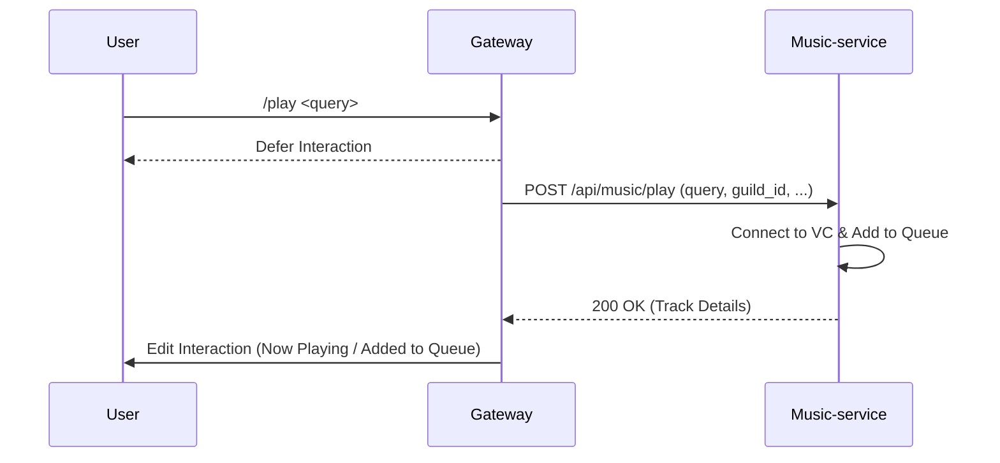

## Pause / Resume Flow
1. User clicks the "Pause" or "Resume" button on a music UI embed, or uses the corresponding slash command.
2. Gateway receives the interaction and sends a REST PUT request to the Music-service containing the target playback state.
3. Music-service updates the audio player's state (pausing or resuming execution).
4. Music-service publishes an async `player_state_changed` event.
5. Gateway consumes the event and updates the initial UI embed to reflect the current paused/playing state.

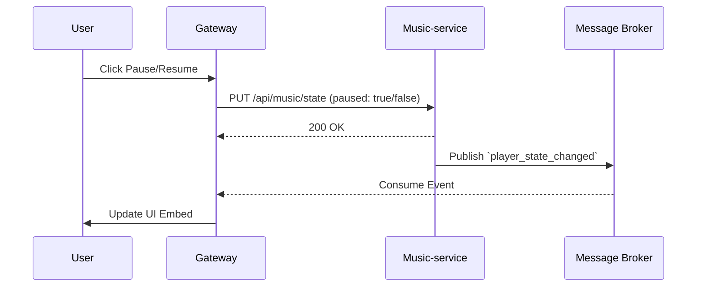

## Skip Track Flow
1. User invokes the `/skip` command or clicks the "Skip" UI button.
2. Gateway sends a REST POST request to the Music-service to skip the current track.
3. Music-service halts current playback and shifts the queue to the next track.
4. Music-service publishes a `track_skipped` async event.
5. Gateway acknowledges the user's interaction and waits for the subsequent `track_started` event to update the UI.

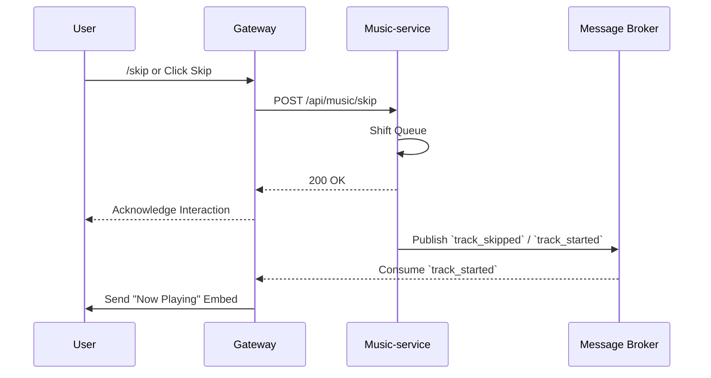

## Add to Queue Flow
1. User invokes the `/play <query>` command while a song is already playing.
2. Gateway sends a REST POST request to the Music-service.
3. Music-service resolves the track, appends it to the existing queue, and returns the queue position via the REST response.
4. Gateway replies to the user with an "Added to Queue" confirmation message.

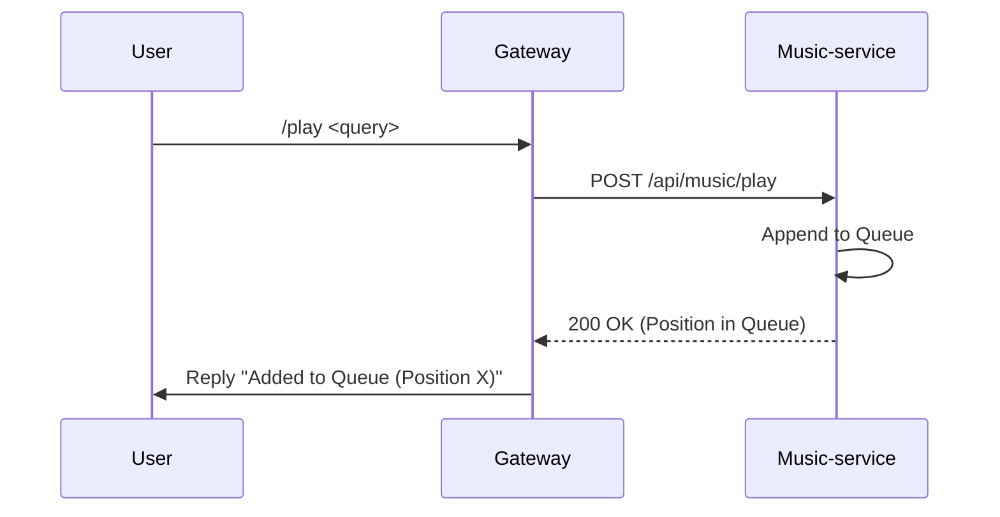

## Volume Change Flow
1. User invokes the `/volume <level>` command.
2. Gateway validates the input (e.g., 1-100) and sends a REST PUT request to the Music-service.
3. Music-service applies the volume scaling to the guild's audio player.
4. Music-service replies with a success status.
5. Gateway sends a confirmation message to the user.

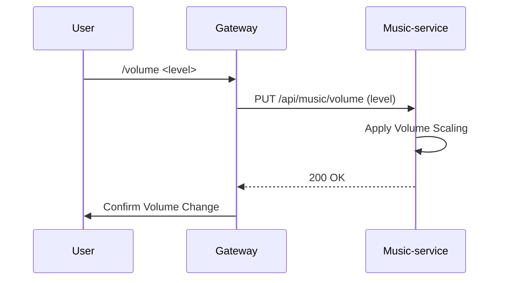

## Loop Mode Flow
1. User invokes the `/loop <mode>` command (modes: track, queue, off).
2. Gateway sends a REST PUT request to the Music-service specifying the loop mode.
3. Music-service updates the queue configuration for the specific guild.
4. Music-service publishes a `queue_config_updated` async event.
5. Gateway consumes the event and updates the active music UI embed to show the active loop state.

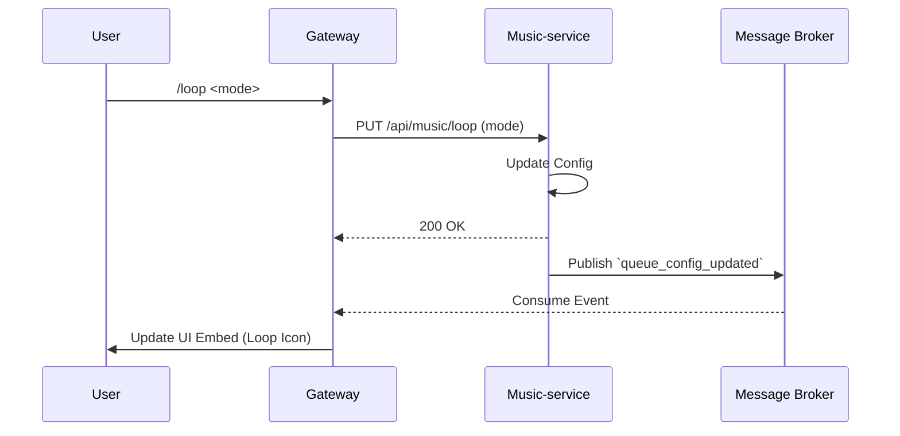

## Leave Voice Channel Flow
1. User invokes the `/leave` command, or the voice channel becomes empty.
2. Gateway sends a REST DELETE request to the Music-service to destroy the guild's player.
3. Music-service clears the queue, disconnects from the voice channel, and frees resources.
4. Music-service publishes a `player_destroyed` async event.
5. Gateway consumes the event, deletes the active music UI embeds, and confirms the departure in the text channel.

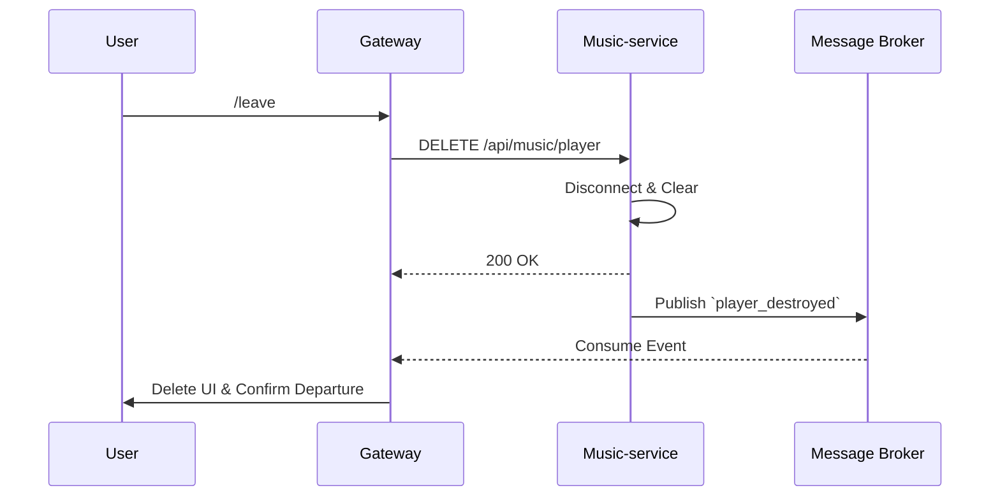

## Track Finished Flow
1. Music-service finishes playing the current audio track.
2. Music-service automatically dequeues the next track and publishes a `track_finished` async event.
3. If a new track starts, Music-service publishes a `track_started` async event.
4. Gateway consumes the `track_started` event and posts a new "Now Playing" UI embed in the designated music text channel.

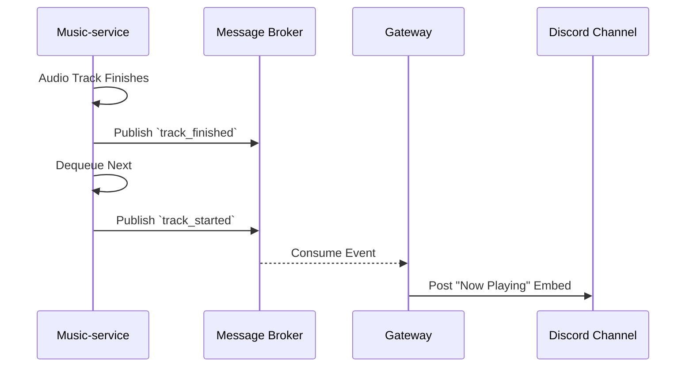

---

### Moderation Flows

## Kick User Flow
1. Moderator invokes the `/kick <user> <reason>` command.
2. Gateway sends a REST POST request to the Moderation-service with the target user ID, moderator ID, guild ID, and reason.
3. Moderation-service logs the infraction in the database.
4. Moderation-service makes an API call to Discord (either directly or via the Gateway) to execute the kick.
5. Moderation-service returns a success response to the Gateway.
6. Gateway replies to the interaction with a successful kick confirmation.

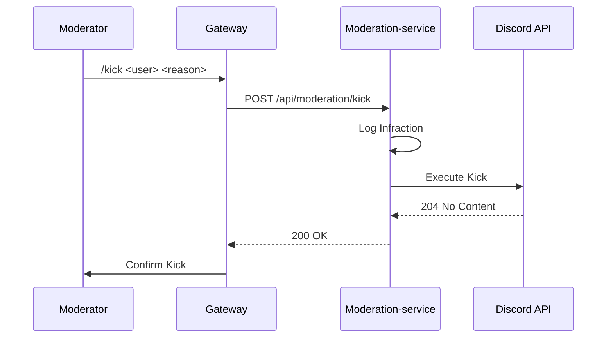

## Ban User Flow
1. Moderator invokes the `/ban <user> <reason>` command.
2. Gateway sends a REST POST request to the Moderation-service.
3. Moderation-service validates permissions against the Config-service (via internal REST) and logs the ban.
4. Moderation-service executes the ban action.
5. Moderation-service publishes a `user_banned` async event for audit logging.
6. Gateway replies to the moderator with a success message.

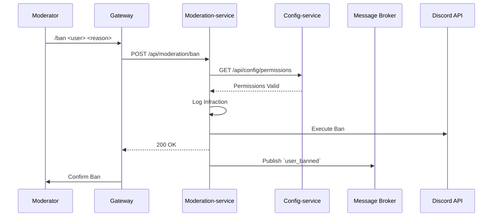

## Mute User Flow
1. Moderator invokes the `/mute <user> <duration> <reason>` command.
2. Gateway sends a REST POST request to the Moderation-service.
3. Moderation-service calculates the mute expiration time, logs the infraction, and applies the timeout/mute role.
4. Moderation-service sends a payload to the Scheduler-service to register an `expire_mute` job for the future.
5. Gateway receives the success response and confirms the mute to the moderator.

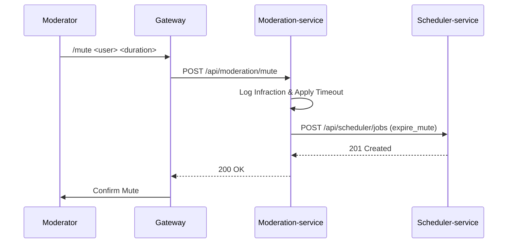

---

### User / Config Flows

## Auto-Role Flow
1. Gateway detects an `on_member_join` Discord event.
2. Gateway publishes an async `member_joined` event.
3. Moderation-service consumes the event and makes a REST GET request to the Config-service to retrieve the guild's auto-role settings.
4. If an auto-role is configured, Moderation-service executes the role assignment.
5. Moderation-service publishes a `role_assigned` event for audit/logging purposes.

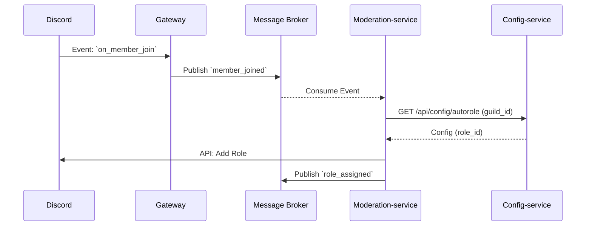

## Fetch Guild Config Flow
1. Gateway receives any command execution.
2. Gateway attempts to read the guild configuration (e.g., prefix, language) from its local cache.
3. If a cache miss occurs, Gateway sends a REST GET request to the Config-service.
4. Config-service retrieves the settings from the database (or its own Redis cache) and returns them.
5. Gateway updates its local cache and proceeds with processing the command.

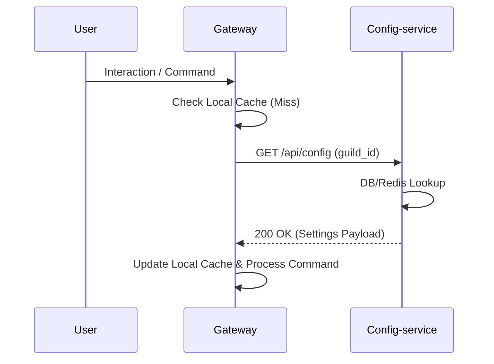

---

### Scheduler Flows

## Birthday Notification Flow
1. Scheduler-service hits a daily cron trigger (e.g., 00:00 UTC).
2. Scheduler-service sends a REST GET request to the User-service to fetch all users with birthdays on the current date.
3. User-service returns a list of target users and their primary guild IDs.
4. Scheduler-service publishes a `birthday_notification` async event for each user.
5. Gateway consumes the event, formats a congratulatory embed, and sends it to the configured general channel of the respective guilds.

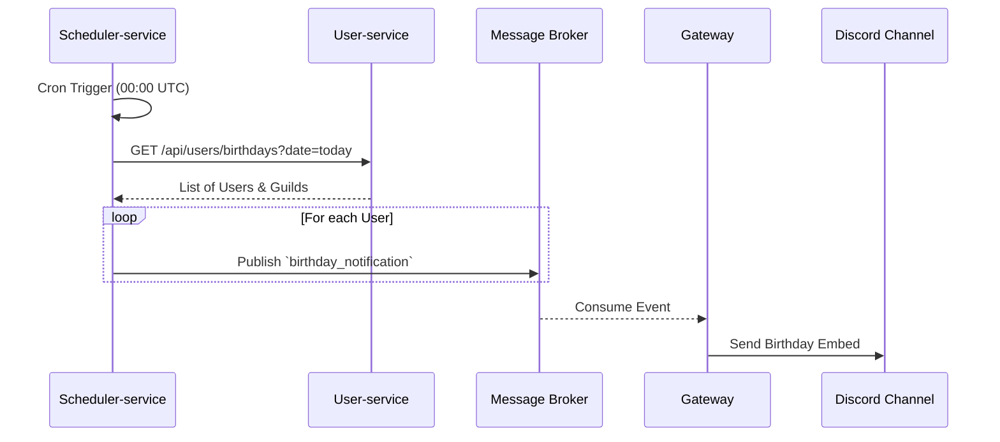

---

### Failure Flow

## Music Service Unavailable
1. User invokes the `/play <query>` command.
2. Gateway attempts to send a REST POST request to the Music-service.
3. The request times out or the Music-service returns a 503 Service Unavailable error.
4. Gateway's internal configured Retry mechanism attempts the request 2 more times.
5. Upon repeated failure, the Gateway's Circuit Breaker trips to the "Open" state to prevent cascading failures.
6. Gateway immediately responds to the user's interaction with an ephemeral error message: "The Music service is currently unavailable. Please try again later."
7. Circuit Breaker handles cooldowns before periodically allowing a test request to see if the Music-service has recovered.

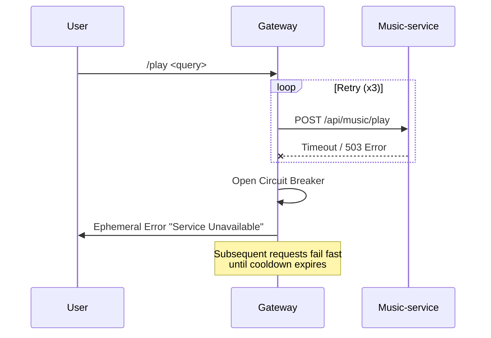
